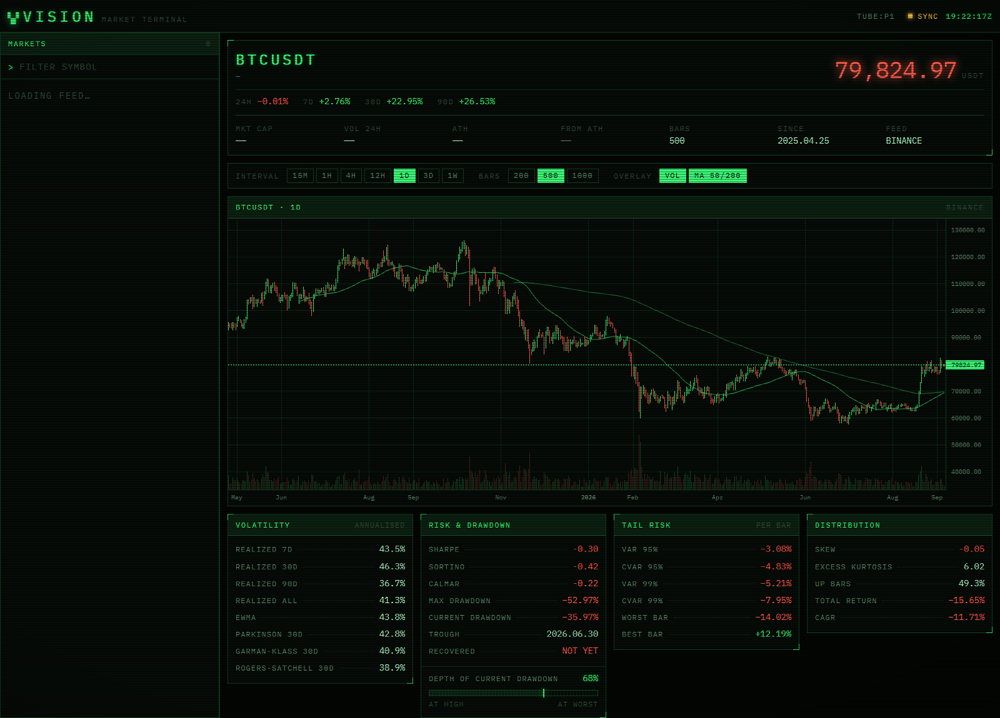

# VISION

A crypto market terminal in the style of a 1980s trading desk. It charts any
USDT pair and, for each one, computes the volatility and risk statistics that
actually inform a decision — realised and range-based volatility, drawdown,
Sharpe/Sortino/Calmar, VaR and expected shortfall, return shape, and the usual
technical indicators.

Informational only. Every number is derived from historical candles and says
nothing about what happens next.



## Stack

| Layer     | Choice                                        | Why |
| --------- | --------------------------------------------- | --- |
| Backend   | FastAPI + pandas/numpy                        | The statistics are the product; pandas does them in a few lines and is easy to test. |
| Frontend  | React 19 + Vite + TypeScript                  | Fast dev loop, strict types across the API boundary. |
| Charts    | lightweight-charts 5                          | Built for financial series, ~40 kB gzipped, no chart-library bloat. |
| Data      | Binance → CryptoCompare, plus CoinGecko       | Binance for candles, CoinGecko for names/market cap, CryptoCompare as fallback. |

## Getting started

Requires Python 3.11+ and Node 20+.

```bash
git clone https://github.com/ImKnight21/Vision.git
cd Vision
cp .env.example .env          # optional: no API key is needed to run
```

**Backend** (terminal 1):

```bash
cd backend
python -m venv .venv
.venv/Scripts/activate        # Windows;  source .venv/bin/activate elsewhere
pip install -r requirements-dev.txt
uvicorn app.main:app --reload
```

**Frontend** (terminal 2):

```bash
cd frontend
npm install
npm run dev
```

Open <http://localhost:5173>. The Vite dev server proxies `/api` to the backend,
so both halves run on one origin.

Tests:

```bash
cd backend && python -m pytest      # 29 tests, no network required
cd frontend && npm run typecheck
```

## API

All endpoints are `GET` under `/api`. Interactive docs at
<http://localhost:8000/docs>.

| Endpoint             | Purpose |
| -------------------- | ------- |
| `/health`            | Liveness plus cache occupancy. |
| `/intervals`         | Candle intervals the API accepts. |
| `/markets?limit=`    | Ranked USDT pairs: price, 24h move, volume, market cap, logo. |
| `/ohlcv/{symbol}`    | Raw candles. |
| `/stats/{symbol}`    | The full statistical profile. |
| `/overview/{symbol}` | Candles **and** statistics in one round trip — what the UI uses. |

Query parameters: `interval` (default `1d`), `limit` (bars, 30–1000).

Percentages are returned as **fractions**: `0.0241` means +2.41%. Any statistic
that could not be computed from the available history is `null` rather than a
fabricated number — a coin with ten days of history reports no 90-day
volatility.

```bash
curl "http://localhost:8000/api/stats/BTCUSDT?interval=1d&limit=1000"
```

## What the numbers mean

Each statistic and how to read it is documented in
[docs/STATISTICS.md](docs/STATISTICS.md). The short version:

- **Volatility** — four estimators. Close-to-close is the textbook one;
  Parkinson, Garman-Klass and Rogers-Satchell also use the bar's high and low,
  so they converge faster on short histories. Rogers-Satchell is the one to
  trust while a coin is trending.
- **Risk** — Sharpe, Sortino and Calmar, plus the depth and dates of the worst
  drawdown and whether it has recovered.
- **Tail risk** — historical VaR and CVaR at 95% and 99%. Historical rather than
  parametric, because crypto returns are far too fat-tailed for a normal
  assumption to survive contact with reality.
- **Distribution** — skew and excess kurtosis, which say whether the big moves
  are crashes or melt-ups and how much fatter the tails are than a bell curve.

## Layout

```
backend/
  app/
    analytics/     volatility, risk, indicators, returns → summary
    sources/       binance, coingecko, cryptocompare adapters
    routers/       HTTP surface
    service.py     cache + source fallback + the price/metadata merge
    cache.py       TTL cache with single-flight
  tests/
frontend/
  src/
    api/           typed client mirroring the backend payloads
    components/    Header, MarketList, PriceChart, StatPanel, Meter, …
    styles/        CRT design tokens and global styles
docs/
```

## Design

A monochrome phosphor tube: one monospace typeface, no rounded corners, colour
used only where it carries meaning. Two tube types ship — P1 green and P3 amber
— toggled from the header and remembered per browser. Scanlines and vignette
are decoration and step aside for `prefers-reduced-motion`.

The system is documented in [docs/DESIGN.md](docs/DESIGN.md); the tokens live in
[frontend/src/styles/tokens.css](frontend/src/styles/tokens.css).

## Configuration

Everything is optional — the app runs with no `.env` at all. See
[.env.example](.env.example). Notable knobs:

- `VISION_TTL_MARKETS` / `VISION_TTL_OHLCV` — cache lifetimes in seconds.
- `VISION_CORS_ORIGINS` — comma-separated allowed origins.
- `COINGECKO_API_KEY` — raises the free rate limit; without it CoinGecko is
  still used, just more sparingly.

## Licence

Not yet chosen.
